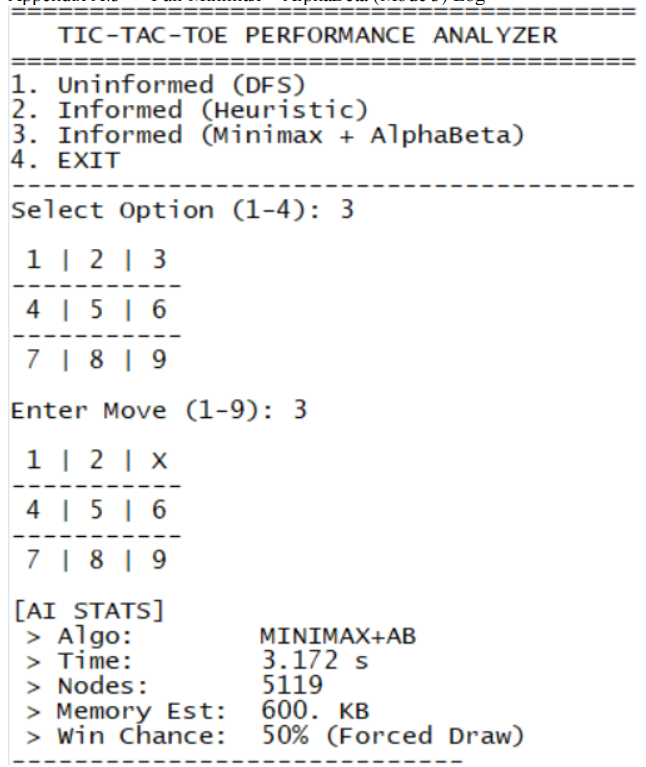

# 🤖 Intelligent Tic-Tac-Toe

[](https://lisp-lang.org/)
[]()

## 🧠 Project Overview
The **Intelligent Tic-Tac-Toe** project is an interactive terminal-based game engineered using the functional programming language Common Lisp. It leverages the foundations of classic Artificial Intelligence. Players can face off against an AI opponent controlled by the **Minimax Algorithm**, making the AI strictly unbeatable.

## 🎲 Key Features
*   **Minimax Algorithm:** Complete mathematical decision tree implementation guaranteeing the AI either wins or forces a draw.
*   **Functional Design:** Emphasizes state immutability, recursive function trees, and list manipulations typical of Lisp architecture.
*   **Interactive REPL UI:** Enjoyable and clean command-line interface directly within the Common Lisp REPL.

## 🖥️ Tech Stack
*   **Programming Language:** Common Lisp (CLISP / SBCL)
*   **Core Concepts:** Applied AI, Game Theory, Recursion

## 📷 Screenshots


*Figure 1: A user attempting (and failing) to defeat the Minimax-driven AI in the terminal.*

## 📂 Project Structure
```text
AI_TicTacToe_Lisp/
├── src/            # .lisp files containing the Minimax engine and game state logic
├── docs/           # Game theory trees and logic explanations
└── assets/         # Terminal gameplay screenshots
```

## ⚙️ Installation & Setup
1. Ensure your machine has a Common Lisp interpreter installed (e.g., SBCL or GNU CLISP).
2. Clone the repository to your disk.

## 🕹️ How to Run
1. Open your terminal or command prompt.
2. Start the Lisp interpreter: `sbcl` or `clisp`
3. Load the game file: `(load "tictactoe.lisp")`
4. Begin the game using the main function call: `(start-game)`
